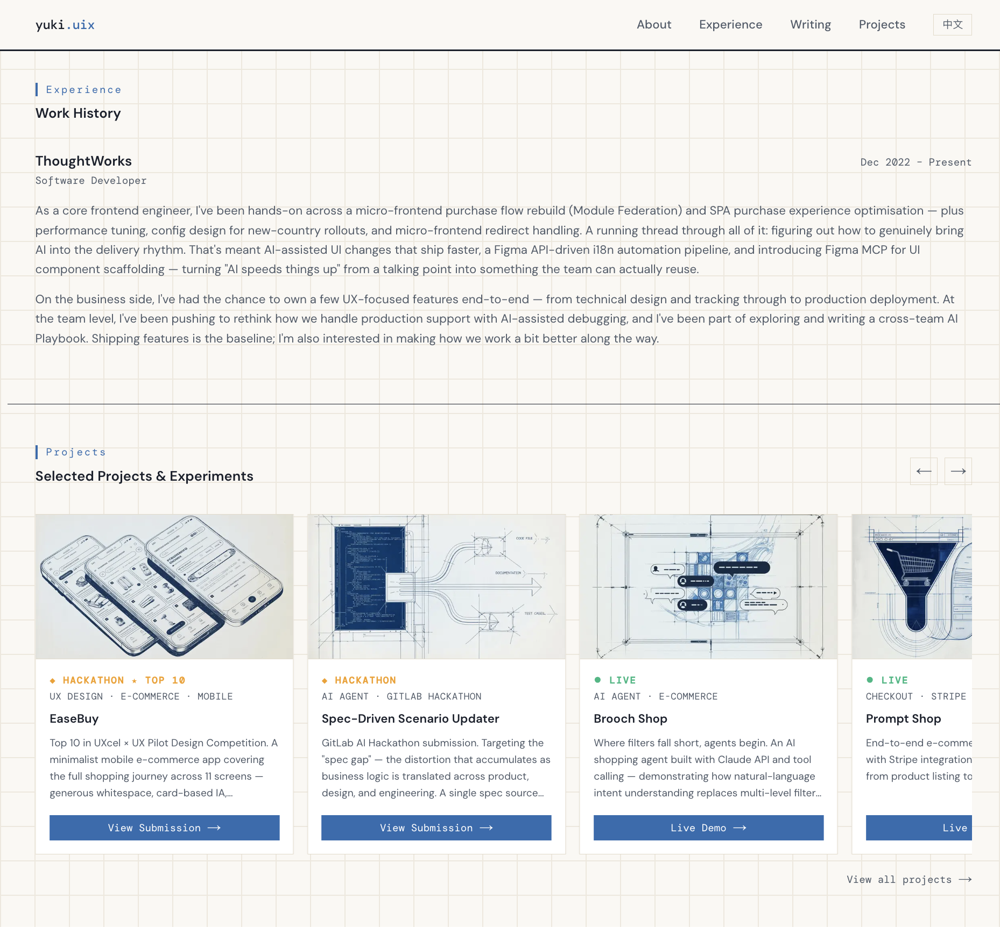

# yukiuix.com


> Design engineer portfolio — bilingual, motion-considered, built to think out loud.



---

## Why this exists

Most portfolios list skills. This one tries to show how I think.

I studied architecture before I wrote code. That gave me a framework for understanding how people navigate systems — not just how they click, but why they stop, turn back, or give up. This site applies that lens to frontend: every layout decision, every animation, every piece of copy has a reason.

---

## What's inside

| Feature | Detail |
|---------|--------|
| **Infinite carousel** | Clone-based loop — auto-advance, hover-pause, silent `transitionEnd` jump |
| **Bilingual i18n** | `next-intl` with locale-aware routing and per-locale content |
| **Playground grid** | Status strip + animated reveal on hover (`translate-x` + background fill) |
| **OG image** | `ImageResponse`-generated, middleware-blocked from direct browser access |
| **Canonical writing** | Articles live here as MDX; platform posts are declared as variants, not separate entries |
| **RSS** | Per-locale feed at `/feed.xml` and `/en/feed.xml`, slug-based `guid` so migrated posts don't re-notify |

---

## Design decisions

**Carousel on home, grid on playground — why?**
Home is a first impression. Motion creates energy and implies there's more to discover. Playground is for comparison — a static grid lets you scan everything at once without distraction.

**Clone-based loop instead of CSS `animation`**
Needed granular control: auto-pause on hover, arrow navigation that resets the timer, smooth looping without a flash. Clone + `transitionEnd` silent jump gives full behavioral control. CSS keyframes would fight every interaction.

**`translate-x` strip reveal for status indicators**
The colored strip is anchored to the `<li>`, not the card. The card slides right on hover, revealing more of the strip beneath. Gap between original position and card is always filled by color — so the reveal feels physical, like pulling a card from a sleeve.

**One article, many platform variants**
The same piece gets restructured for WeChat, Juejin, and dev.to — different titles, different shape. Modelling each platform post as its own entry meant the archive listed one article up to three times. Now an article is a single record with a `source` (`self` or `external`) and a list of `variants`. Self-hosted pieces render from `content/writing/<slug>.<locale>.mdx` and declare `rel="canonical"` on themselves; everything else keeps linking out. `source` flips per article, so migration happens one piece at a time.

**Locale fallback instead of a 404**
An article can have a Chinese body and no English one yet. `/en/writing/<slug>` still renders — it shows the body that exists, says so above the fold, and points `canonical` at the locale that actually holds that text, so the two URLs never compete as duplicate content.

**Hand-written long-form CSS, not `@tailwindcss/typography`**
The plugin's defaults (rounded corners, drop shadows, neutral greys) fight the warm off-white and 0.5px hairlines this site is built on. Overriding them back costs more than the ~150 lines in `.prose-article`.

**Canonical URLs have to be the URLs that actually serve**
`localePrefix: "as-needed"` — Chinese is the primary language and gets no prefix, so `/writing` serves directly instead of redirecting to `/zh/writing`. A `canonical` or `hreflang` pointing at a redirect is a weak signal, and the whole point of hosting originals here is to make that signal unambiguous. Every absolute URL on the site comes from `lib/site.ts`, so the prefix rule lives in exactly one function. The sitemap goes further and lists only the locale that actually has a body — advertising a URL whose own `canonical` points elsewhere would undo the work.

**Feed items point at wherever the piece currently lives**
The feed reuses the same `articleLink()` the list pages use, so it can never disagree with the site. `guid` is the slug, not the URL — when an article moves from a platform to this site its link changes but its identity doesn't, and subscribers don't get it twice.

**Middleware gating on `/opengraph-image`**
The OG route needs to exist for crawlers (`Accept: image/*`) but shouldn't be navigable in a browser (`Accept: text/html`). Middleware checks the header and redirects humans to `/` while letting bots through.

---

## Stack

```
Next.js 14 (App Router) · TypeScript · Tailwind CSS · next-intl
```

---

## Structure

```
app/[locale]/
  page.tsx          # Home — Hero, Projects carousel, About
  playground/       # Full project grid
  writing/          # Archive, plus [slug]/ for self-hosted articles
  feed.xml/         # Per-locale RSS (a top-level app/feed.xml/ mirrors the default)
components/
  Projects.tsx      # Infinite auto-carousel
  Playground.tsx    # 3-col grid with animated status strip
  ArticleBody.tsx   # MDX → RSC, with heading anchors and scrollable tables
content/writing/    # <slug>.<locale>.mdx — the article bodies themselves
data/
  projects.ts       # Single source of truth for all project data
  articles.ts       # Article metadata, canonical/variant relationships
lib/
  writing.ts        # Reads content/, resolves locale fallback, reading time
  feed.ts           # RSS 2.0 builder, shares articleLink() with the UI
  site.ts           # Absolute URLs — the one place the locale-prefix rule lives
```

---

## Writing & contact

[yukiuix.com](https://yukiuix.com) · [掘金 (Juejin)](https://juejin.cn/user/3582625834347100) · [LinkedIn](https://linkedin.com/in/kunyu-xu) · [yuki.uix@gmail.com](mailto:yuki.uix@gmail.com)
